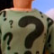
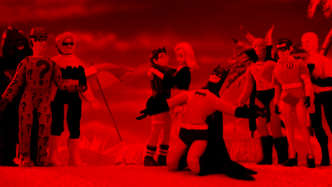
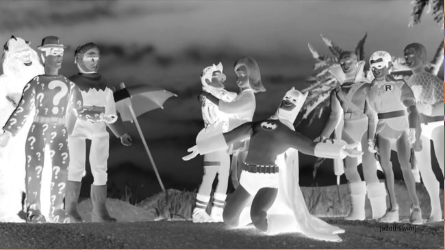

# Zettel 1 - Computer Vision ws15/16

* __Name:__ Alexander Hinze-Hüttl
* __Matrikel Nr.:__ 4578322
* __eMail:__ hinze.alex@gmail.com

## Aufgabe 1: die ersten Schritte (5 Punkte)
Für Bildverarbeitung wurde Python und die PIL Bibliothek verwendet:
### 1.1 - Bild öffnen
```python
from PIL import Image

img = Image.open("image.jpg")
img.show()
```


### 1.2 - Subimage
```python
from PIL import Image

def getSubImg(img, x, y, width, height):
	subimage = Image.new("RGBA", (width, height))
	for i in range(x, x+width):
		for j in range(y, y+height):
			subimage.load()[i - x, j - y] = img.load()[i,j]
	return subimage

img = Image.open("image.jpg")
subimg = getSubImg(img, 50,100,60,60)
subimg.show()
subimg.save("aufg12.png")
```


### 1.3 - Rotkanal
```python
from PIL import Image

def getChannel(img,channel):
	img = img.convert("RGB")
	subimage = Image.new("RGB", img.size)
	for x in range(img.size[0]):
		for y in range(img.size[1]):
			r = 0
			g = 0
			b = 0
			if channel == "R":
				r = img.load()[x,y][0]
			elif channel == "G":
				g = img.load()[x,y][1]
			elif channel == "B":
				b = img.load()[x,y][2]
			subimage.load()[x, y] = (r,g,b)
	return subimage

img = Image.open("image.jpg")
channel = getChannel(img, "R")
channel.show()
channel.save("aufg13.png");
```


### 1.4 - Spiegeln
```python
from PIL import Image

def mirror(img,axis):
	newImg = Image.new("RGB", img.size)
	width, height = img.size
	for x in range(width -1):
		for y in range(height-1):
			if axis == "x":
				newImg.load()[x,y] = img.load()[width - x -1, y]
			if axis == "y":
				newImg.load()[x,y] = img.load()[x,height - y -1]
	return newImg

img = Image.open("image.jpg")
m = mirror(img, "x")
m.show()
m.save("aufg14.png")
```


### 1.5 - Grauwertskalierung
```python
import Image

def rgb2gray(img):
	width, height = img.size
	for x in range(width -1):
		for y in range(height -1):
			r,g,b = img.load()[x,y]
			g = int(0.2989 * r + 0.5870 * g + 0.1140 * b)
			img.load()[x,y] = (255-g,255-g,255-g)

img = Image.open('image.jpg')
rgb2gray(img)
#img = Image.open('image.jpg').convert('LA')
img.show()
img.save("aufg15.png")
```


## Aufgabe 2: Human vs. Computer Vision
| - | Auge | Kamera |
|---|------|--------|
| Fokussierung 1  | durch Streckung der Linse      |  durch Abstand von Objektiv      |
| Fokussierung 2 |  Fokus auf Punkt | Fokus auf alle Punkt mit gleichem Abstand |
| Dimension | durch 2 Augen, 3D Bild | durch ein Objektiv, 2D |
| blinder Punkt | vorhanden, dort wo Sehnerven zusammenlaufen | nicht vorhanden |
| Spektrum | zwischen 760 nm (rot) und 380 nm (blau) | theoretisch unbegrenzt | 

## Aufgabe 3: das invertierte After-Image
Unverändertes, langes Betrachten führt zur Ermüdung der beanspuchten Fotorezeptoren. Batrachtet man anschließend eine weiße Fläche, bleiben Signale der ermüdeten Fotorezeptoren aus. Das Gehirn überinterpretiert die ankommenden Signale und erstellt ein Komplementärbild.
