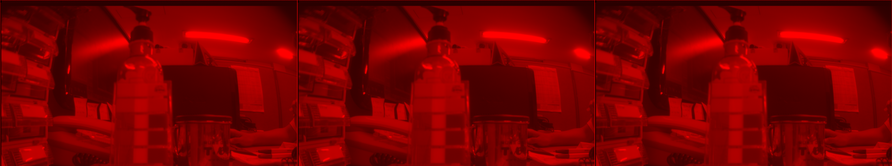
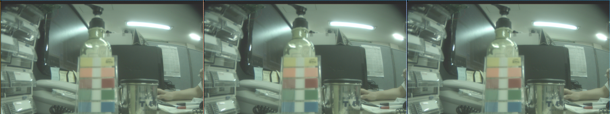

# Zettel 1 - Computer Vision ws15/16

* __Name:__ Alexander Hinze-Hüttl
* __Matrikel Nr.:__ 4578322
* __eMail:__ hinze.alex@gmail.com

## 1. Aufgabe - Kamerasensoren

## 2. Aufgabe - Pinhole-Kamera-Projektion

### 2.1 Pinhole - Brennweite = 10000

### 2.2.1 Pinhole - Brennweite = 5000

### 2.2.2 Pinhole - überlagert

### 2.3 parallele Projektion

## 3. Aufgabe - Bayer-2-Color

### 3.1 - Subimage

### 3.2 - Konvertiert
__Der Stift hat die Farbe rot.__

