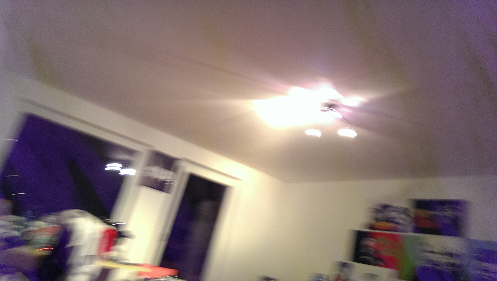
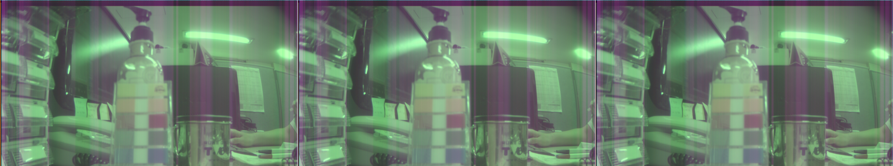

# Zettel 2 - Computer Vision ws15/16

* __Name:__ Alexander Hinze-Hüttl
* __Matrikel Nr.:__ 4578322
* __eMail:__ hinze.alex@gmail.com

## 1. Aufgabe - Kamerasensoren
__Rotation__

__Translation__

## 2. Aufgabe - Pinhole-Kamera-Projektion

### 2.1 Pinhole - Brennweite = 10000

### 2.2.1 Pinhole - Brennweite = 5000

### 2.2.2 Pinhole - überlagert

### 2.3 parallele Projektion

## 3. Aufgabe - Bayer-2-Color

### 3.1 - Subimage

### 3.2 - Konvertiert
__Der Stift ist rot.__ (glaube ich, hab eine Rot-Grün-Schwäche)

