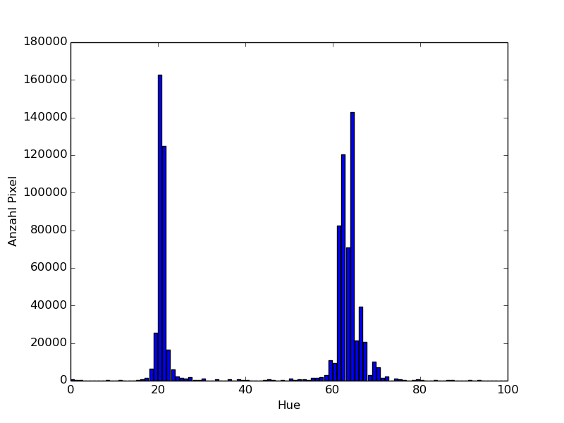
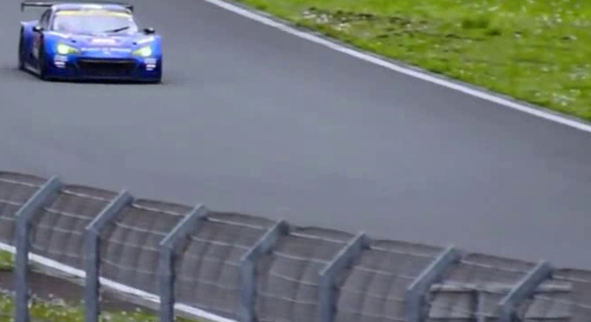
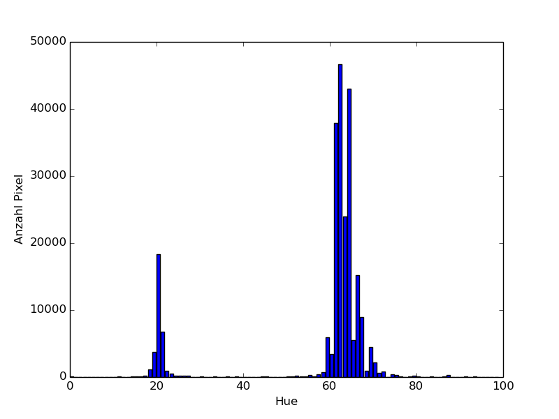

# Zettel 3 - Computer Vision ws15/16

* __Name:__ Alexander Hinze-Hüttl
* __Matrikel Nr.:__ 4578322
* __eMail:__ hinze.alex@gmail.com

## 1. Aufgabe - Farbräume
### 1.1 Histogramm über das komplette Bild
 

### 1.2 Histogramm über das Teilbild
__Teilbild:__
 

 
