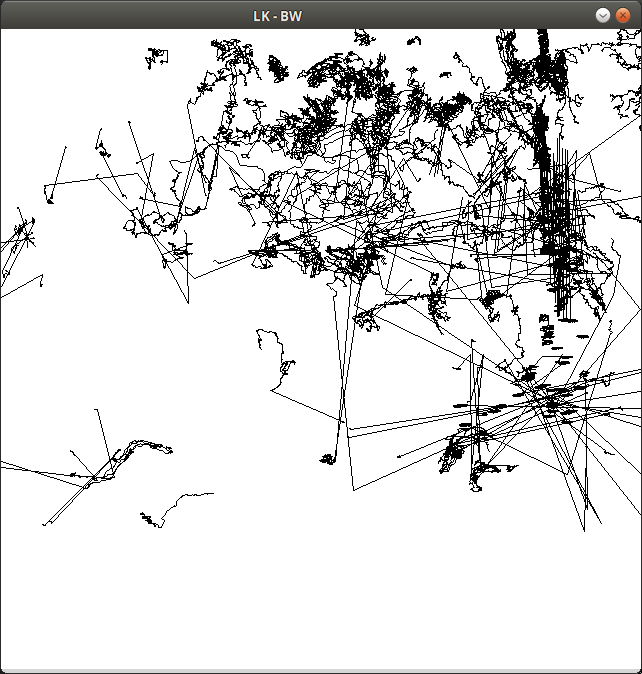

# Zettel 5 - Computer Vision ws15/16

* __Name:__ Alexander Hinze-Hüttl
* __Matrikel Nr.:__ 4578322
* __eMail:__ hinze.alex@gmail.com

## Aufgabe 1

### selbst implementierter Lucas-Kanade:
* Fenstergröße 15x15
1. ohne Gewichtung:

2. mit Gewichtung:

## OpenCV Imeplementierung:
* Fenstergröße 15x15

