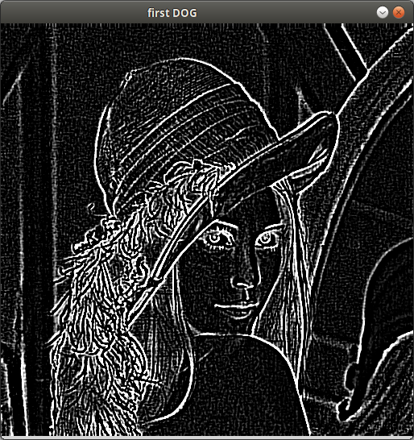
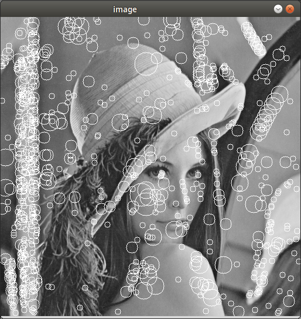
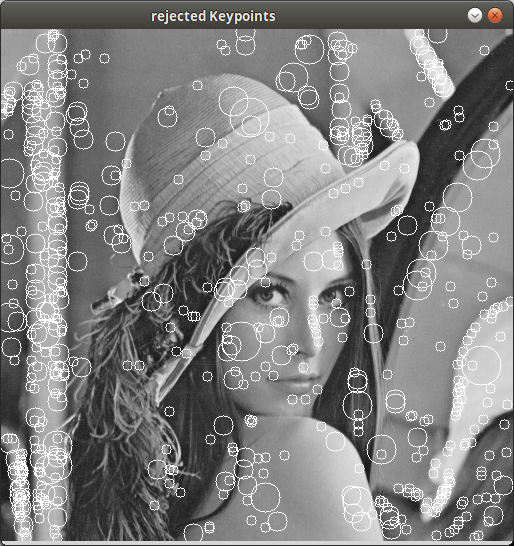
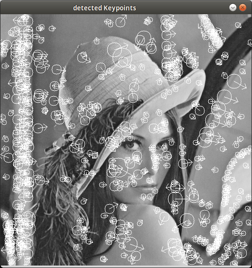
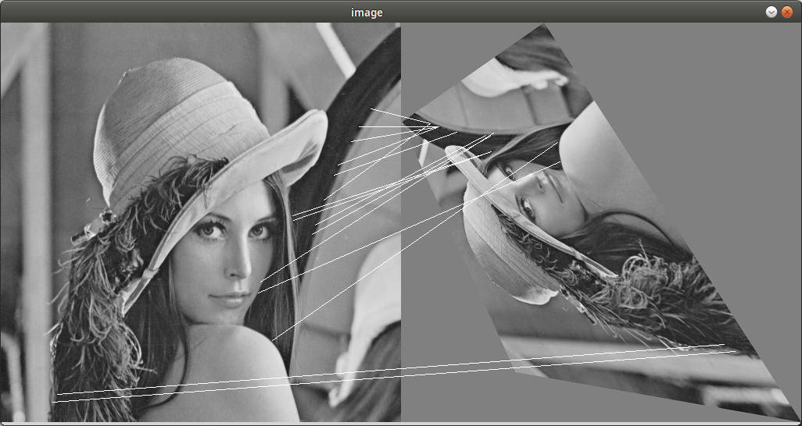
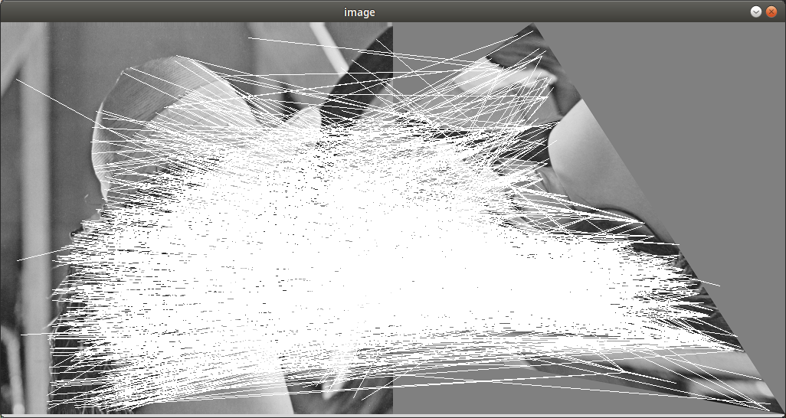

# Zettel 7 - Computer Vision ws15/16

* __Name:__ Alexander Hinze-Hüttl
* __Matrikel Nr.:__ 4578322
* __eMail:__ hinze.alex@gmail.com

__Ergebnisse variieren start in Anhängigkeit von verwendeten Kerneln und deren Größe ab.__

# Aufgabe 1: Scale Space (4 Punkte)
* __unterste und oberste Schicht der DoG-Pyramide__

# Aufgabe 2: Keypoint-Detektion und Aussieben (4 Punkte)

* __Vor Rejection: 766 Keypoints:__

* __Nach Rejection: 562 Keypoints:__

# Aufgabe 3: Keypoint-Orientierung (4 Punkte)

# Aufgabe 4: Keypoint-Matching (4 Punkte)
* __Besten 9 Korrespondenzen__

* __Alle Korrespondenzen__

